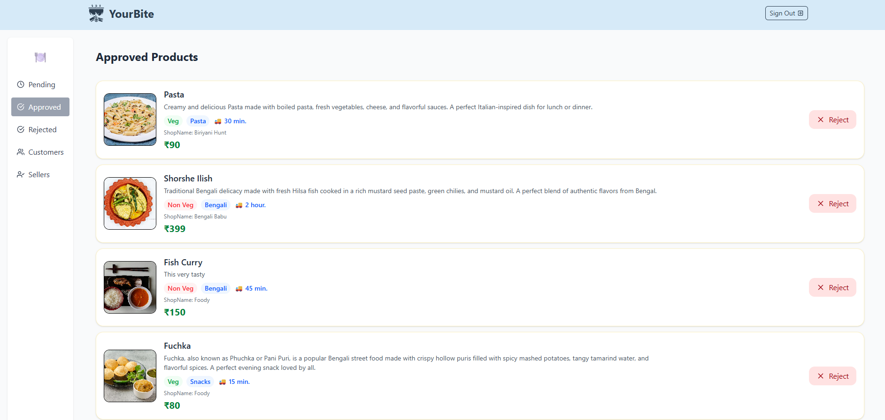
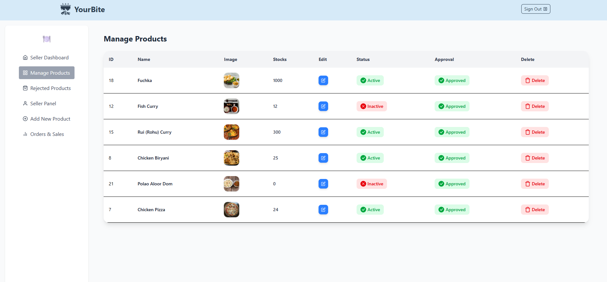
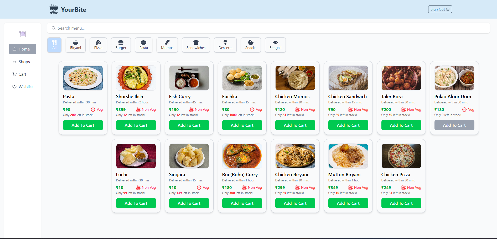

# 🍴 YourBite – Food Delivery Web App

This is a **practice project** built to learn and apply **React, Supabase, and Tailwind CSS**.  
It simulates a food delivery web application where users can browse menus, search food items, and place orders.

---

## 🚀 Features

- User authentication (Sign up / Log in)
- Browse food items by category (Veg / Non-Veg)
- Search and filter menu items
- Add to cart & manage items
- Responsive design for all devices
- Separate dashboards for **Admin, Seller, Customer, and Delivery Boy** to manage their respective features

---

## 🛠️ Tech Stack

- **Frontend:** React, Tailwind CSS
- **Backend:** Supabase (Database & Auth)
- **Deployment:** Netlify

---

## ⚡ Getting Started

### 1️⃣ Clone the repo

```bash
git clone https://github.com/m-pratap-13/yourbite-app.git
cd yourbite-app
```

### 2️⃣ Install dependencies

```bash
npm install
```

### 3️⃣ Setup environment variables

Create a `.env` file in the root folder and add your Supabase credentials:

```env
VITE_SUPABASE_URL=your_supabase_url
VITE_SUPABASE_ANON_KEY=your_supabase_anon_key
```

### 4️⃣ Run locally

```bash
npm run dev
```

---

## 📸 Screenshots

_Add screenshots of your app here._  
To add:

1. Take a screenshot
2. Save it in the `/public/screenshots/` folder
3. Add like this:
   _Admin dashboard interface for managing food listings and users._
   
   _Seller panel for adding, updating, and managing menu items._
   
   _Customer view for browsing menus, searching food, and placing orders._
   

---

## 🎯 Purpose of the Project

This is not a production app.  
It’s a **practice project** to learn:

- React fundamentals & advanced hooks
- Supabase integration
- Authentication & authorization
- State management
- Deployment process

---

## 📌 Future Improvements

- Payment gateway integration
- Order tracking
- Real-time notifications
- Dark mode support

---

## 🙌 Acknowledgements

- [React](https://react.dev/)
- [Supabase](https://supabase.com/)
- [Tailwind CSS](https://tailwindcss.com/)
